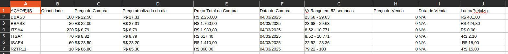

# Documentação de uma API de cadastro de usuario, contas e ações e fundos de investimentos com auditoria do usuario, além de download de relatórios em excel com dados específicos de investimentos com comunicação com uma API externa em Java 21, Spring Boot e banco de dados relacional PostgreSQL e não relacional Mongo DB.

A API esta documentada via Swagger:

http://localhost:8090/swagger-ui/index.html#/


# Endpoints

```
USUARIOS 

POST - /v1/users    -    Registrar um novo usuário com a senha criptografada no banco
GET  - /v1/users/{cpf}    -   Listar usuário por cpf
GET  - /v1/users    -    Listar todos usuários
PUT  - /v1/users/update-user   -   Atualizar informações de usuário
PUT  - /v1/users/inactive-user/{cpf}   -   Inativar usuário por cpf
PUT  - /v1/users/reactive-user/{cpf}   -   Reativar usuário por cpf
DELETE  - /v1/users   -   Deletar usuario do banco 
```


```
CONTAS 

POST - /v1/account    -    Registrar uma nova conta pegando o usuario como referência
POST - /v1/account/billing-address    -   Registrar endereço de cobrança da conta em referência
GET  - /v1/account/{cpf}    -    Listar informações da conta e ações e fundos
```


```
AÇÕES E FUNDOS 

POST - /v1/stock/buy    -    Registrar novo ticker de ação ou fundo
GET  - /v1/stock/download-report    -   Download de relatórios de ações e fundos em excel
GET  - /v1/account/{cpf}    -    Listar informações de ações e fundos paginada
POST - /v1/stock/sale   -   Remover ação ou fundo da conta
```


# Informações importantes

* Ao adicionar um usuario usando o cpf como referência e auditoria do usuario salvos no banco Mongo DB
* Os demais registros consultas são salvos no PostgreSQL

Enum de Operation que descreve qual ações do usuario são salvas na tabela de auditoria

```
    DOWNLOAD_SPREADSHEET(1, "Download Relatório"),
    REGISTER_ACCOUNT(2, "Adicionando Conta"),
    REGISTER_STOCKS(3, "Registro de Ações ou Fiis"),
    SALE_STOCKS(4, "Venda de Ações ou Fiis");
```

API externa da Brapi

* Link do site oficial: https://brapi.dev/
* Informações vindas da API: BigDecimal regularMarketPrice (valor do ticker atualizado ao dia) e String fiftyTwoWeekRange (valor máximo e mínimo do ticker nas últimas 52 semanas)
* Obs: o site disponibiliza um token pessoal para fazer consultas gratuítas limitadas

Download e informações da conta 

* Relatório 1 - ReportType BY_YEAR 
* O usuário passa o documento de referência e o ano q ele quer listar as informações da conta...

Exemplo: 



* Relatório 2 - ReportType TOTAL
* A API faz um cálculo usando o ticker como base e lista todas as ações e fundos cadastrados, o cálculo soma todos os tickers e faz a soma do gasto total e o preço medio do ticker em questão.

Exemplo:


# Como usar a API e informações úteis

Rodar o docker compose:

* Na pasta/caminho onde se localiza o docker-compose.yml, rodar o comando para criar o container:

```docker-compose up -d```

* Remover container:

```docker rm my-mongo```

* Rodar o MS, adicionando o token gerado pelo site do Brapi
* Usar o Swagger para uso


# Ferramentas e Dependências

* Java 21 
* Spring Boot 3.3.0 
* PostgreSQL
* Mongo DB 
* Swagger 
* Spring Security 
* Maven 
* Lombok 
* JUnit / Mockito para testes unitários
* Fastexcel para geração dos relatórios em excel
* Openfeign para comunicação com API externa


